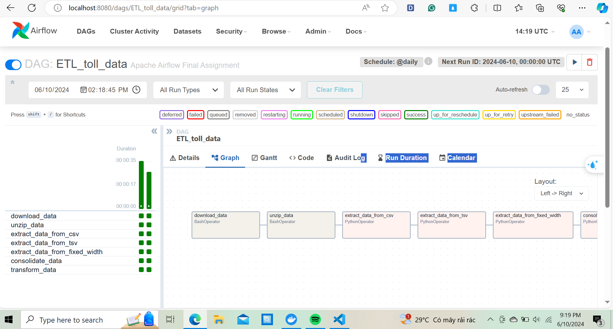

## Running apache airflow 2.0 in docker with local executor.
Here are the steps to take to get airflow 2.0 running with docker on your machine. 
1. Clone this repo
1. Create dags, logs and plugins folder inside the project directory
```bash
mkdir ./dags ./logs ./plugins
```
1. Set user permissions for Airflow to your current user
```
echo -e "AIRFLOW_UID=$(id -u)\nAIRFLOW_GID=0" > .env
```
1. Install docker desktop application if you don't have docker running on your machine
- [Download Docker Desktop Application for Mac OS](https://hub.docker.com/editions/community/docker-ce-desktop-mac)
- [Download Docker Desktop Application for Windows](https://hub.docker.com/editions/community/docker-ce-desktop-windows)
1. Launch airflow init
```bash
docker-compose up airflow-init
```
2. Launch airflow by docker-compose
```bash
docker-compose up -d
```
3. Check the containers
```bash
docker ps
```
3. Running containers
```bash
docker-compose run airflow-worker airflow info
```

5. Open browser and type http://localhost:8080 to launch the airflow webserver. The default account has the login 'airflow' and the password 'airflow'


